Welcome to 2 Rooms and a Boom, a hidden role social game! See [here](https://drive.google.com/drive/folders/1_jbxtyH0V0xACK_crdIbf-QMFv0aw7pr) for the full instructions and character guide. Below are the instructions for 2 Rooms and a Boom on Zoom

# Rules
At the start of the game, you'll receive a link to your role and color. You should download both the color and full card, in case you'd like to show another player later in the game.

There will be two breakout rooms, which will be open for the appropriate round time. Once the round is up, leaders will return to the main Zoom room to exchange hostages and switch rooms. You can message hostage exchanges to Jacob and he will re-assign people to their breakout rooms.

Use Slack for private messages with other players. The honor ystem is in place - you can only message people currently in your breakout room. The only exception is that you may always Slack Jacob with rules clarifications.

Sharing your full card or just the color is OK! You can share this via Slack or share it with everyone in the breakout room.

If you are the current leader, use the Raise Hand feature (found in Reactions)

To start a vote for a new leader, tell the room who you are nominating and what they should do if they want to vote that way (eg raise right hand, raise left hand, tilt head to one side). The person who called the vote should keep track of majority.

Again, honor system: if you're voted out as leader, relinquish gracefully

The leader can also give up leadership by finding a willing player who will turn on the Raised Hand in reactions (then the former leader should put their hand down)

# Characters
Only the below characters are possibly in the game:

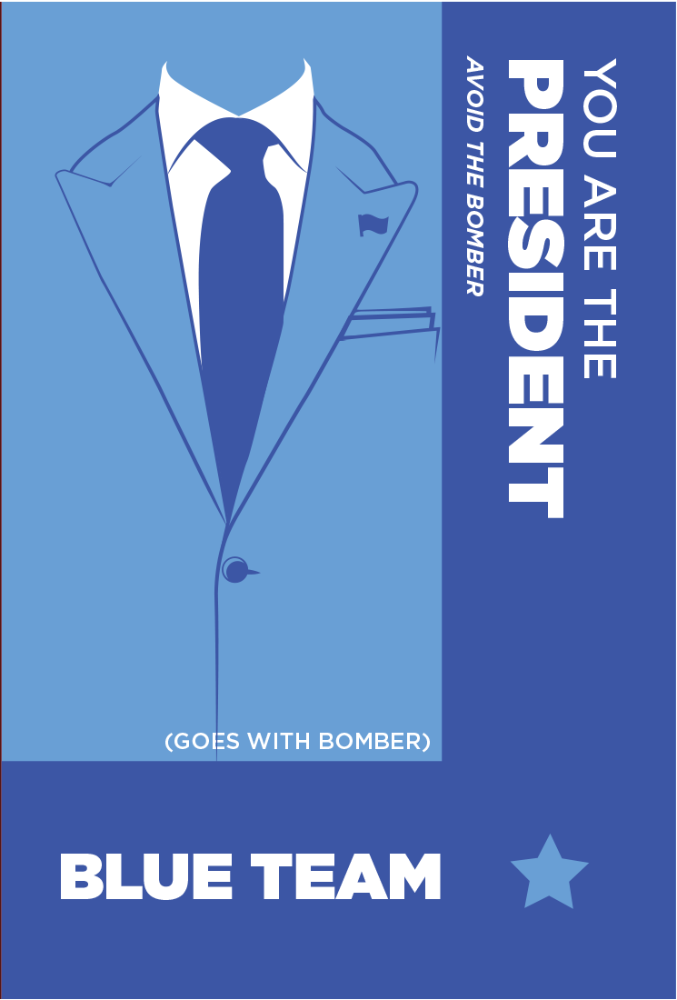
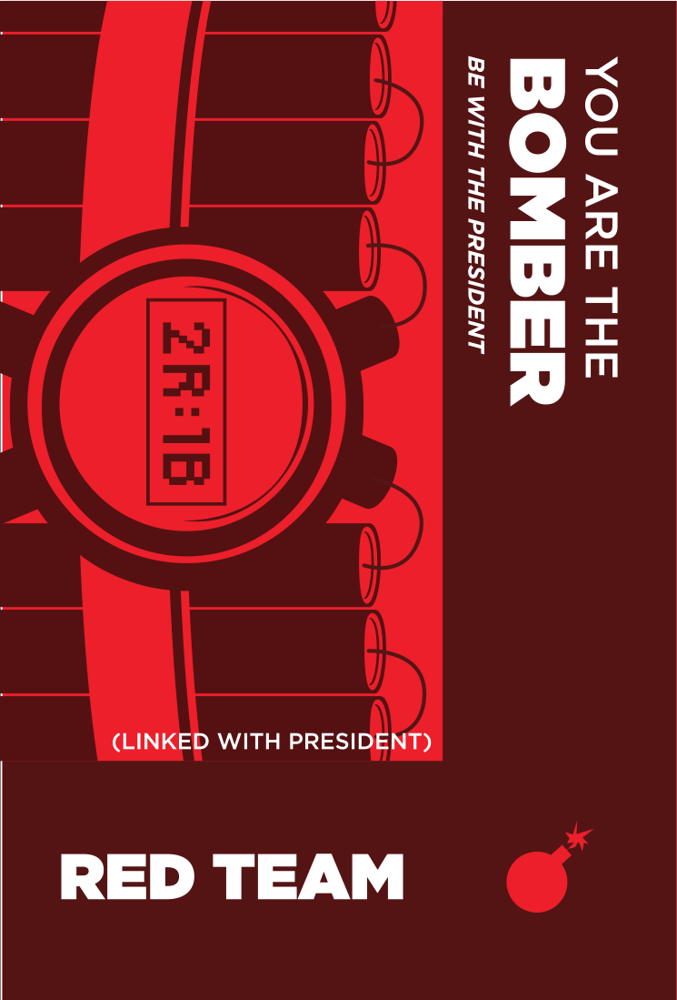
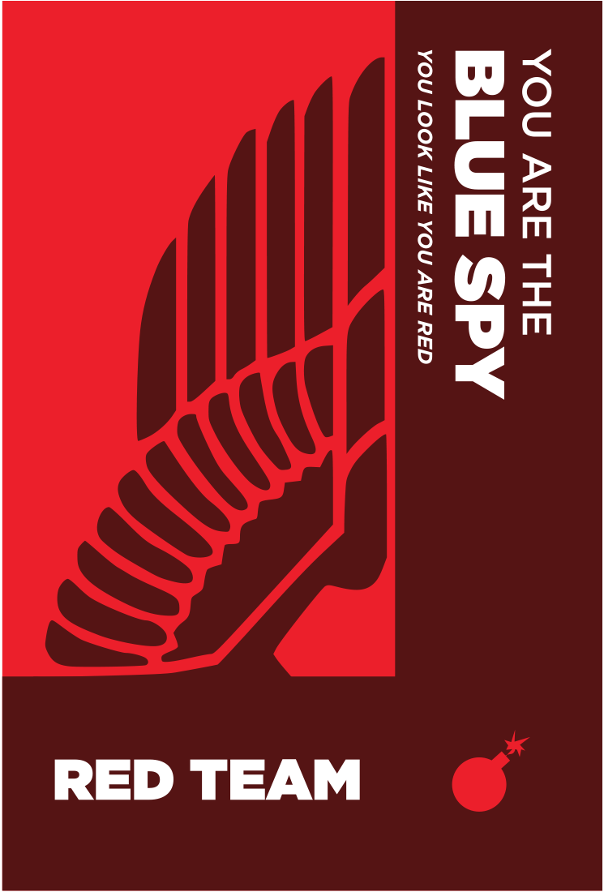
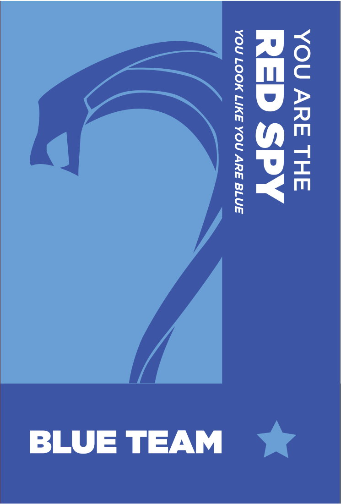
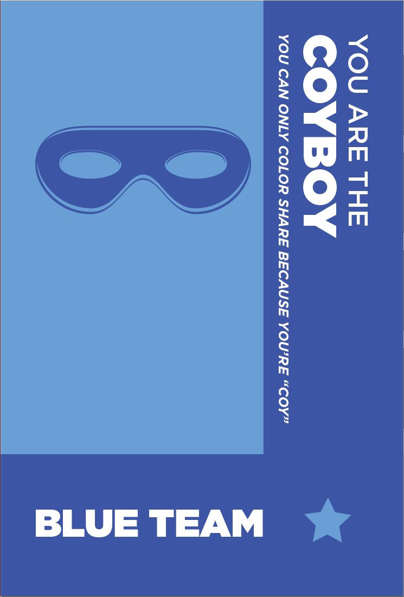

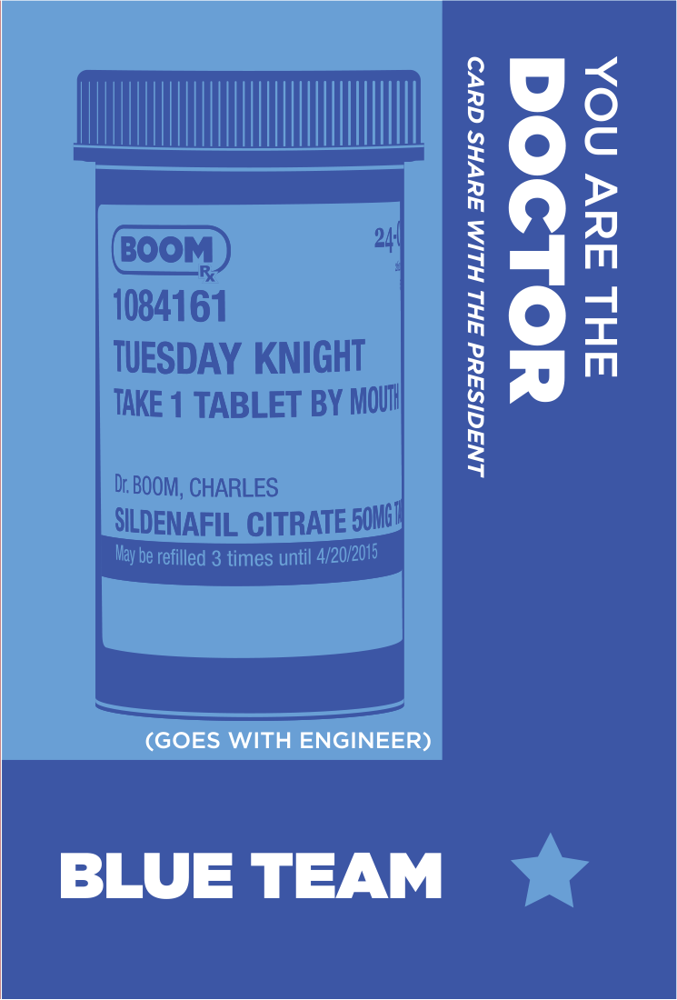

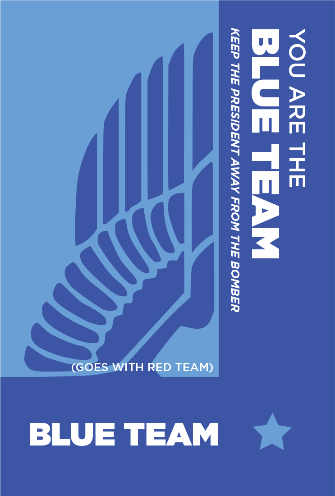
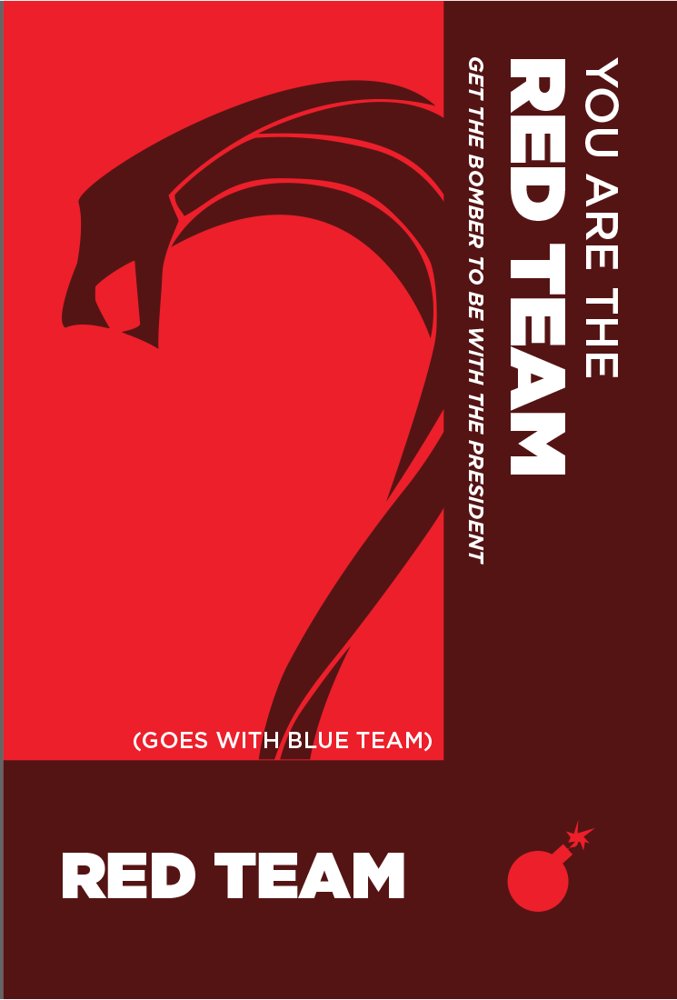
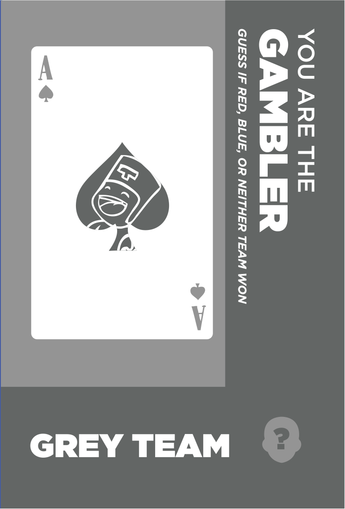
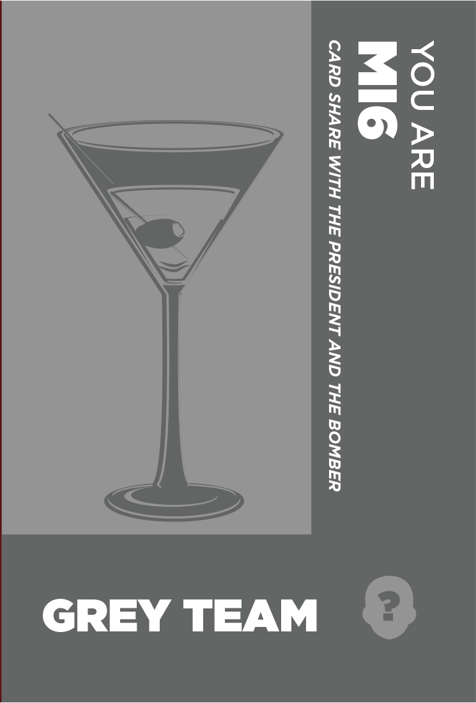
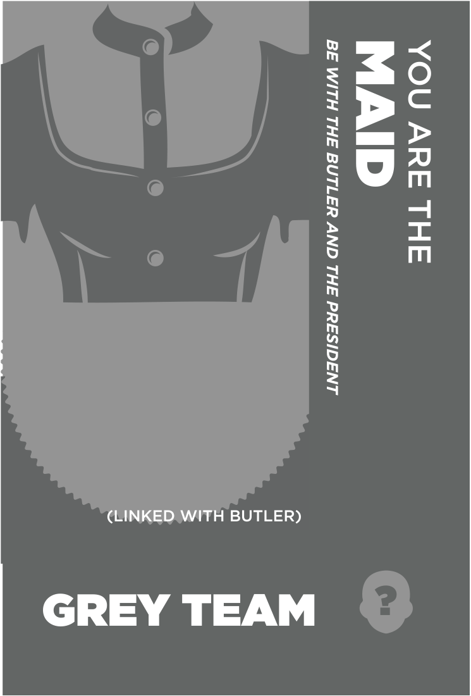
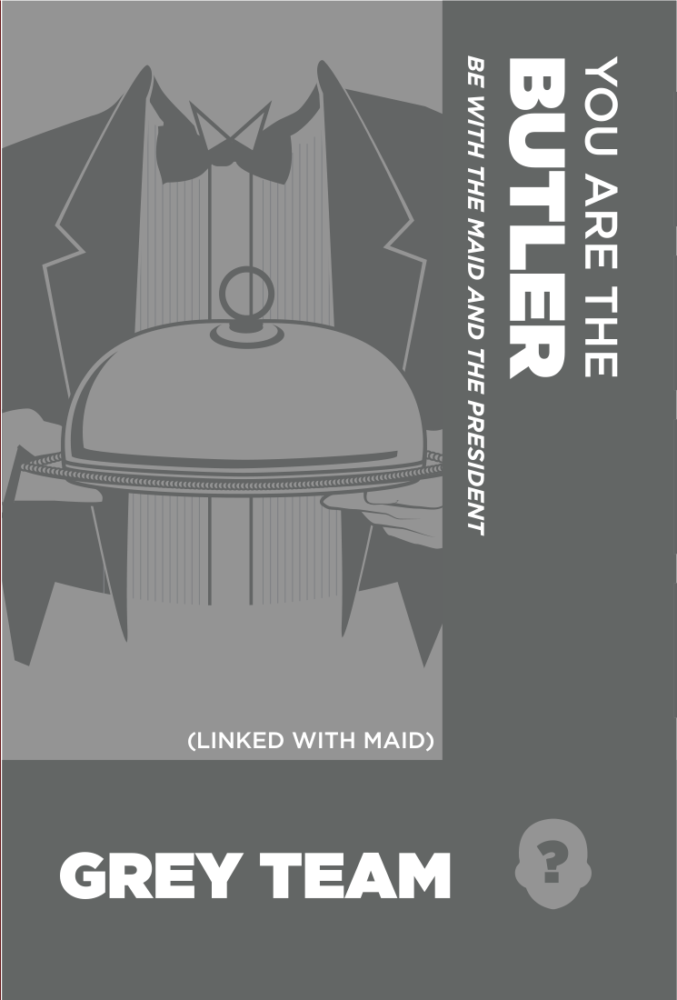

# Colors
Each character sheet will also come with one of the colors below:

