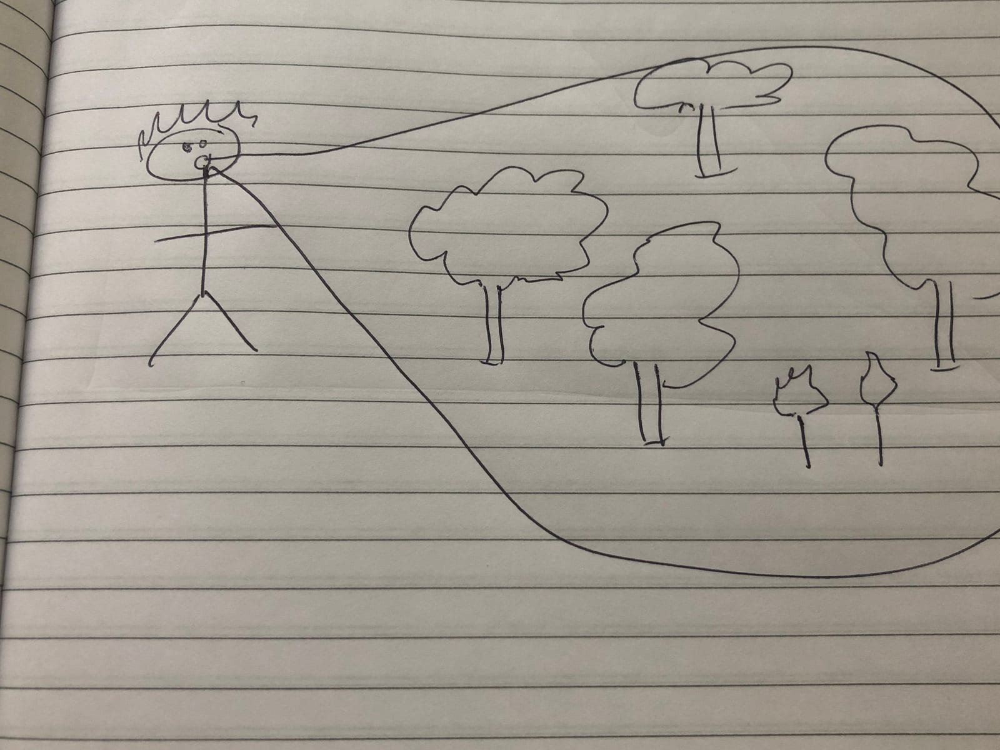

    

        <picture><source type="image/webp" srcset="oreilly.webp"/></picture>
    

 
With a Singaporean squad, and country launches galore 
what was your first turn as squad manage-ore? 

<input id="guess" name="guess" />
<input type="button" value="What squad?" onclick="window.open('/puzzle/javier/' + document.getElementById('guess').value)" />

