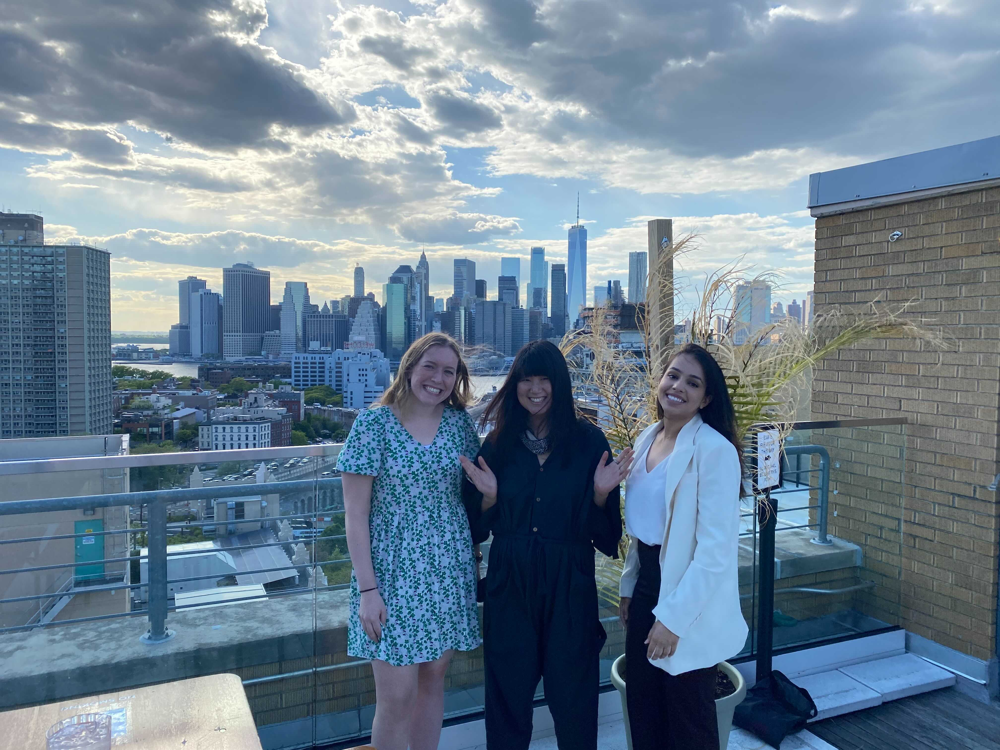

    

        
    

 

Before Growth and Acquisition, was another fun squad 
you led their success but their name was quite odd  

If one didn't know about this acronym, 
understanding their goals might be a problem 

<input id="guess" name="guess" />
<input type="button" value="What was the squad name?" onclick="window.open('/puzzle/karen/' + document.getElementById('guess').value.replace('\'', ''))" />

