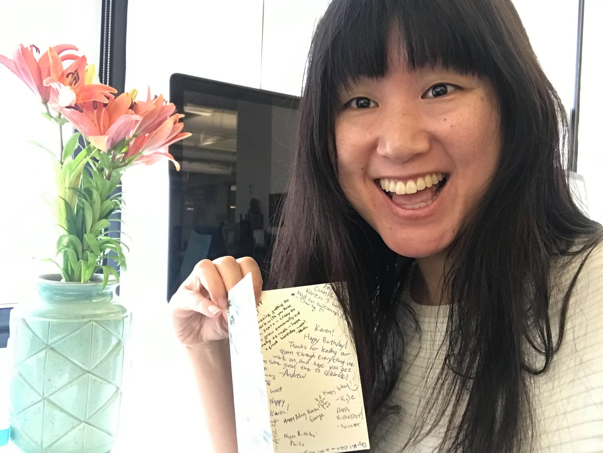

    

        <picture><source type="image/webp" srcset="card.webp"/></picture>
    

 
You're always all-in, of that we are sure, 
You once even had a squad hang in your...  

<input id="guess" name="guess" />
<input type="button" value="Where was your unusual squad hang?" onclick="window.open('/puzzle/karen/' + document.getElementById('guess').value)" />

