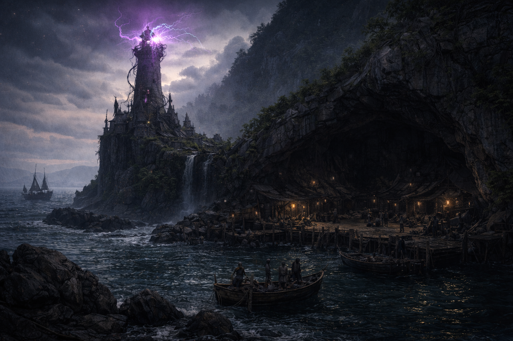
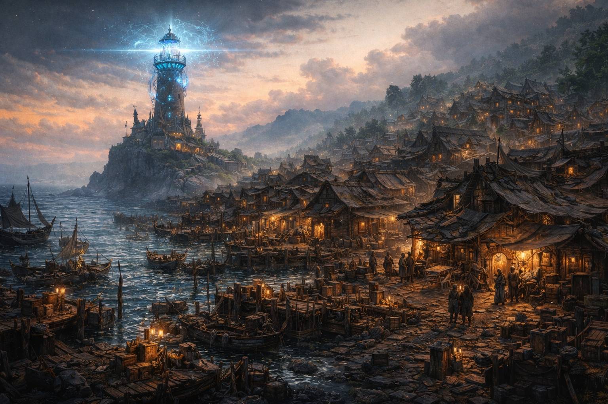

{: .img-splash }

## The Setting
Saltmarsh is a small coastal town clinging to survival at the edge of a fading world, filled with pirates, smugglers, adventurers, and others scratching out a living along the dangerous coast.

Long ago, this coast was protected by powerful arcane lighthouses — ancient wonders that calmed storms, guided ships, and held back dangers from the sea and the deep places below. The city underneath Saltmarsh was the source of these wonders and the capital of the coast. Long ago, a calamity befell the city and it was flooded. The knowledge of the arcane lighthouses was lost. The lights still burn, but only just.

Saltmarsh is built atop the ruins of this one much greater city. Beneath its streets lie flooded districts, forgotten tunnels, and arcane machinery no one fully understands anymore. Although no one can build its like, there are those who are able to keep machinery in the undercity running, preserving a thin sliver of the the previous wonder.

Lately, the lighthouses that protect hundreds of miles of coast have started to go...strange. Some have gone dark, and fog and deadly currents have swept up around them. Others have faded, or their color has changed and dark beasts have started to creep out of the depths. Ships have started to go missing, or be found abandoned - completely seaworthy but with no one on board. This new danger to the Saltmarsh coast has given rise to new opportunities - for gold, for glory, or to help others.

## The Campaign Style
This game uses a West Marches structure, which means:

* Each session is a self-contained expedition
* All adventures begin and end in Saltmarsh
* Different groups of players may adventure together from session to session
* The story is player-driven, not a fixed linear plot

As a player, You’ll choose:

* Which rumors to follow
* Which lighthouses, ruins, or expeditions to investigate
* How much risk to take — and when to turn back

The world changes as a result of player actions. Successes, failures, and choices will permanently affect locations, factions, and the safety of the coast.

{: .img-splash }

### Tone & Themes
Overall tone:
Adventurous and light-hearted without being goofy or silly, with room for serious and meaningful moments.

Expect:
* A lived-in, grounded world
* Humor, camaraderie, and problem-solving
* Occasional danger and moral ambiguity

Themes we'll explore
* Lost knowledge and fading magic
* Preservation vs. progress
* Doing meaningful good even when permanent solutions aren’t possible

Content boundaries:
* Mature themes may arise (loss, danger, difficult choices)
* We will not explore dark or exploitative content (e.g., no sexual violence, no shock-for-shock’s-sake material)
* This will be a collaborative game, and character rivalries will be kept good-natured - we won't set characters against each toher

#### Roleplaying, Combat, and Play Balance
This is not a combat-only game. Combat, traps, and environmental hazards exist and matter, but many of the challenges you'll encounter can be solved via negotiation, exploration, and clever problem-solving (or through the sword if you prefer!)

## What Do I need to do?
* No prior rules knowledge required — we’ll learn as we go
* Beginner-friendly pre-generated characters will be available, which you can personalize. Characters belong to players; if a player isn't at a session, their character is indisposed (on another mission, recuperating after a last fight, or spending their hard-earned coin in the bar). Over time, everyone will have the opportunity to make their character their own, or roll a new character.
    - Character death is possible, but usually avoidable with smart play
* I'm planning on running these weekly or bi-weekly but we'll schedule sessions based on availaility
* You can attend as often or as occasionally as works for you, and you can bring anyone who is curious to play as long as they're excited about the rules above 

