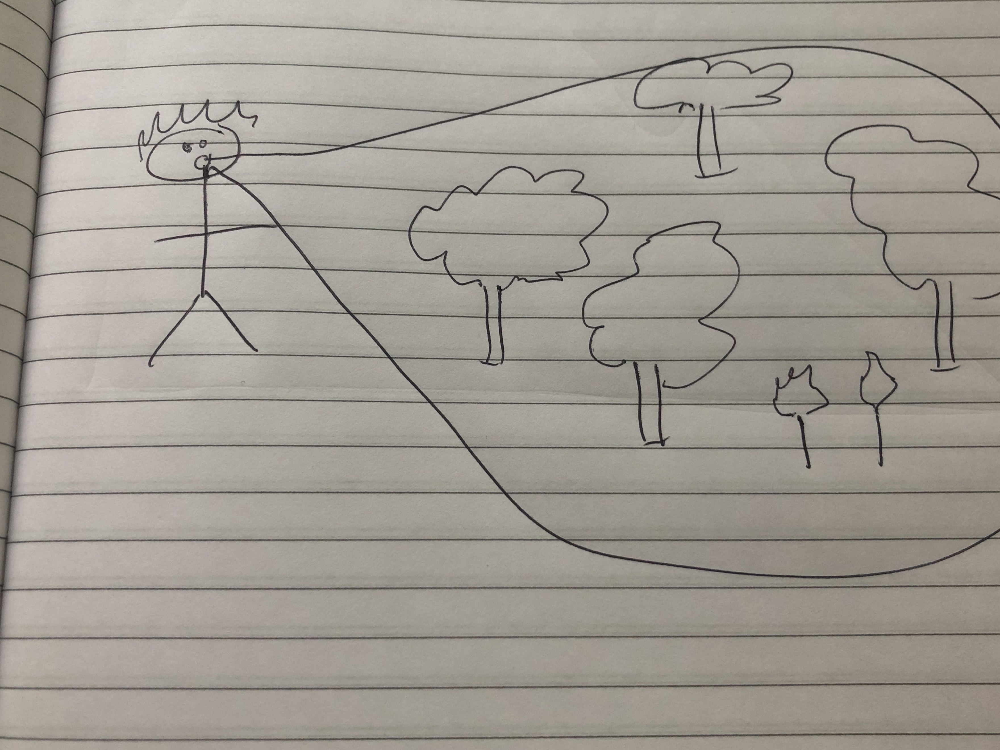

    

        
    

 
Your startup we know, 'twas a prior breadcrumb 
but pray tell me, at ClassPass what did it become? 

<input id="guess" name="guess" />
<input type="button" value="What product?" onclick="window.open('/puzzle/javier/' + document.getElementById('guess').value)" />

