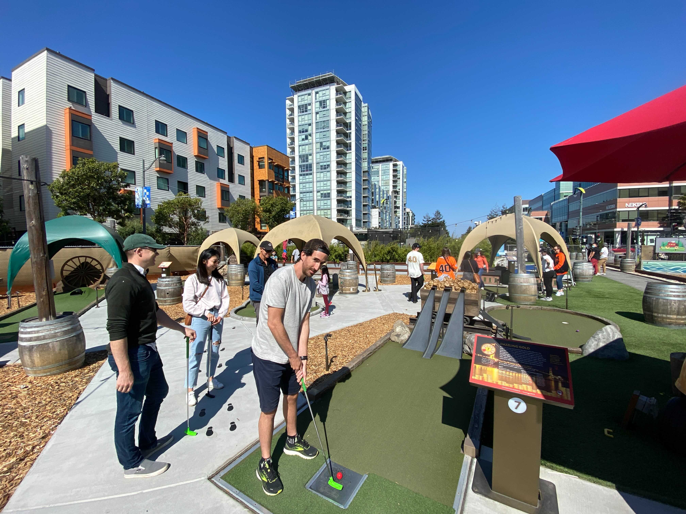

    

        
    

 
One thing that we noticed, in Zoom these past years 
your background kept changing from behind your two ears!  

But why did it change, and what did you do 
so that we could spot differences in each week or two? 

<input id="guess" name="guess" />
<input type="button" value="What did you do?" onclick="window.open('/puzzle/javier/' + document.getElementById('guess').value)" />

