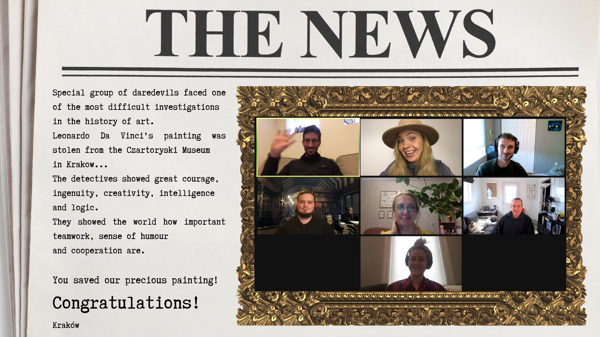

    

        
    

 
You're about to leave ClassPass - sad but exciting it's true. 
But you're not out of here yet, you've got something to do!  

I've asked friends and colleagues to help with my plan 
and I've got plenty of facts about you well in hand.  

Each answer's one word, and one you should know, 
we'll be here to watch, just enjoying the show.  

So there's a path here to follow, and you know what to do: 
tell us how you joined up for the very next clue. 

<input id="guess" name="guess" />
<input type="button" value="How did I join?" onclick="window.open('/puzzle/javier/' + document.getElementById('guess').value)" />

