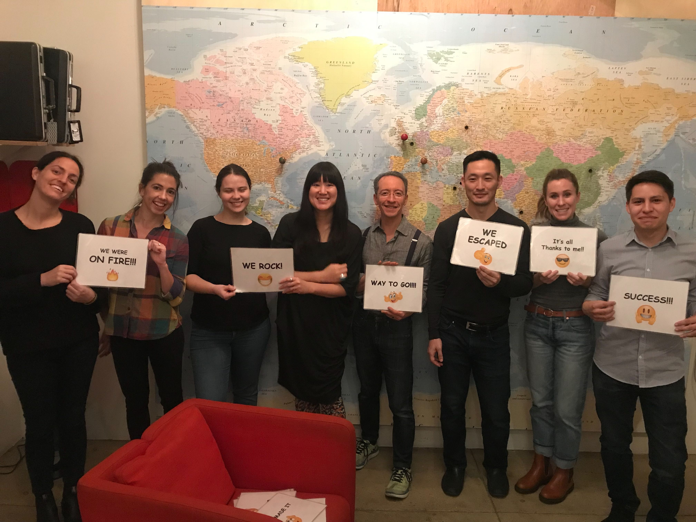

    

        
    

 
Lately you've been managing something quite new, 
A way to let robots do what we do  

This team is bold; daring! With sauve and panache 
what's the name of the squad that is making a splash? 

<input id="guess" name="guess" />
<input type="button" value="What is the squad?" onclick="window.open('/puzzle/karen/' + document.getElementById('guess').value)" />

