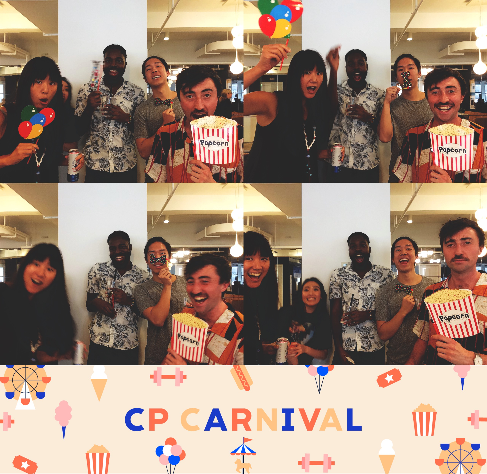
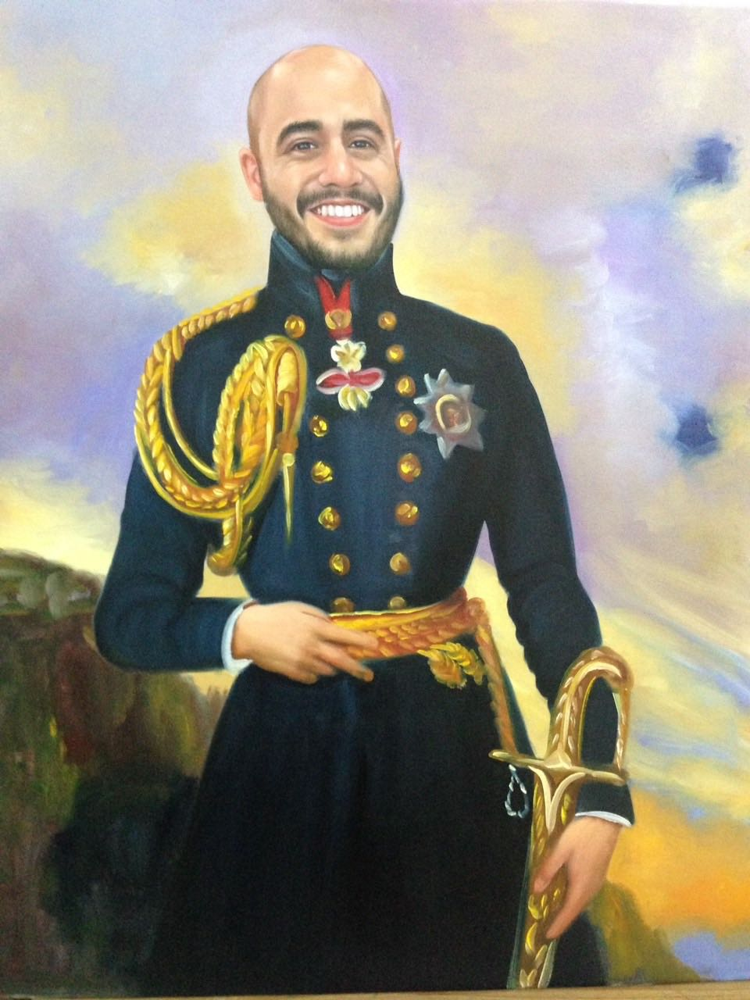

    

        
    

    

        
    

 
'Round here for downtime, we yell nine one one 
but you coined a term: emergencies not yet begun  

when these events happen, we still possibly squirm 
So what do you think you named this new term? 

<input id="guess" name="guess" />
<input type="button" value="What is the term?" onclick="window.open('/puzzle/karen/' + document.getElementById('guess').value)" />

=======
---

I've heard you like travel, and deals galore, 
and we hope your next step has that in store.

But you've found the next clue, O Fortuna, what luck! 
And take a Thanksgiving plane ride to where the next clue is stuck.

<input id="guess" name="guess" />
<input type="button" value="Where Am I?" onclick="window.open('/puzzle/karen/' + document.getElementById('guess').value)" />
>>>>>>> 8cc5830 (Commit)
