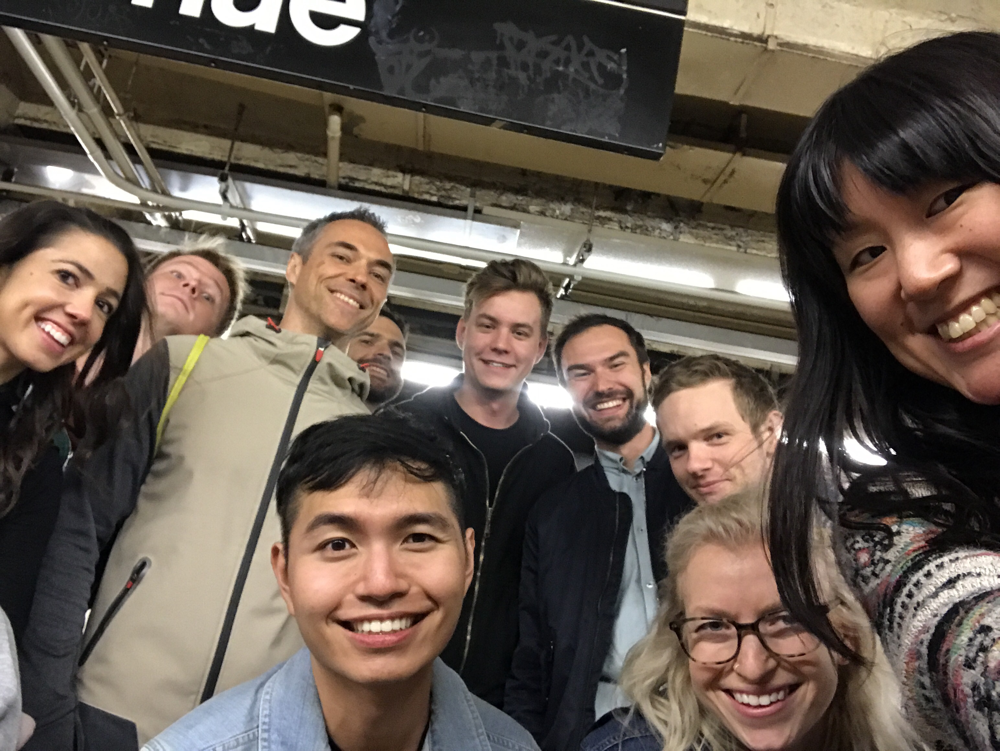

    

        
    

 
You've been here a long time - an eon or more 
At least in years measured by ClassPass time for sure  

Now you know the drill, and what is in store 
Embarrasing old photos and trivia galore.  

Each answer's one word, and one you should know, 
we'll be here to watch, just enjoying the show.  

So there's a path here to follow, and you know toward what: 
for whom did you commission a gallant portrait? 

<input id="guess" name="guess" />
<input type="button" value="Who was the portrai of?" onclick="window.open('/puzzle/karen/' + document.getElementById('guess').value)" />

